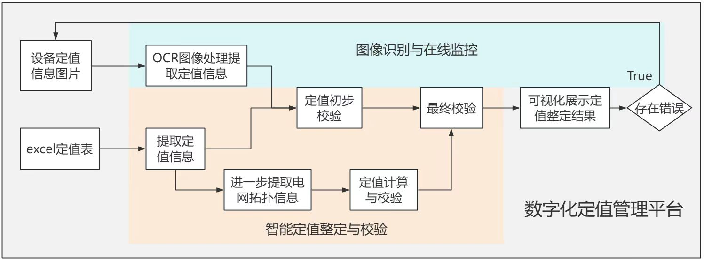

# paddleocr_for_PC

这是一个基于paddleocr开发的pc端软件，配套移动端paddlelite软件使用

## 项目目的



## 项目结构

```
├─main.py	   //实现OCR功能的模块
├─README.md  
├─sync_module.py   //文件同步模块
├─test1.jpg        //测试图片
├─tools		   //辅助工具
|   ├─adb	   
├─SyncedPhotos     //存储图片的结构化目录
|      ├─number_type
|      ├─nameplate
|      ├─external_info
├─output
```

## 项目功能详述

### 文件同步模块

模块代码见[sync_module.py](sync_module.py)

因为我们需要同步的文件来自android移动端的应用私有目录下，所以这里我们只能通过使用adb调试工具来实现两端文件目录的的同步。

此外该模块还实现了增量同步，不会同步已存在的文件，减少了开销。

#### 待定事项

1. 关于增量同步中的列出文件的详细信息，不同版本的列出的信息列表、顺序都可能不一样，后续需要优化。
2. 目前同步需要通过USB接口将移动设备与主机连接，后续可以开发无线模式。
